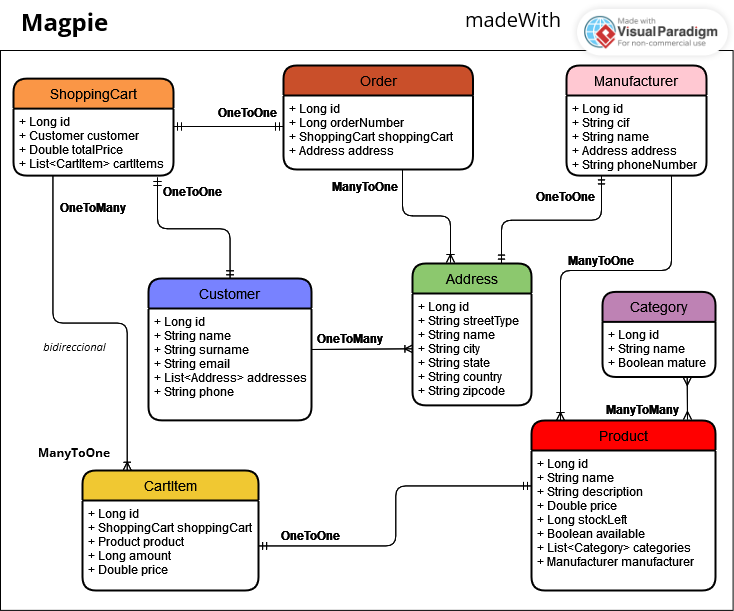

## Pasos a seguir:

1. Crear proyecto Spring Boot con Spring Data JPA y MySQL
2. Crear README
3. Asignar nombre y logo
4. Crear entidades
5. Crear capa servicio
6. Crear controladores
7. Crear interfaz de usuario con HTML5 y Thymeleaf

## Entidades:

### Product
- id: Long. PRIMARY KEY
- name: String
- category: String
- description: String
- price: Double
- manufacturer: Manufacturer @OneToOne
- stock / amountLeft / unit / quantity: Long (número de unidades disponibles)

### Customer
- id: Long. PRIMARY KEY
- name: String
- surname: String (apellido)
- email: String
- address: Address (dirección) @OneToMany
- phone: String

### Manufacturer
- id: Long. PRIMARY KEY
- nif: Long
- name: String
- address: Address @OneToOne
- phone: String

### Address (dirección)
- id: Long. PRIMARY KEY
- streetType: String (tipo de vía: calle, avenida, plaza, etc)
- name: String
- city: String
- state: String
- country: String
- zipcode: String (código postal)

### CartItem
- id: Long. PRIMARY KEY
- product: Product
- amount: Long (cantidad de productos)
- price: Double
- shoppingCart: ShoppingCart @ManyToOne

### ShoppingCart (carrito de la compra)
- id: Long. PRIMARY KEY
- customer: Customer (para saber a quién pertenece el carrito) @OneToOne
- totalPrice: Double
- cartItem: List«CartItem» (lista de productos con la cantidad especificada) @OneToMany

### Order
- id: Long. PRIMARY KEY
- orderNumber: Long (número de pedido)
- shippingCart: ShippingCart @OneToOne
- customer: Customer @OneToOne
- address: Address (el comprador puede tener varias direcciones pero solo se envía a una de ellas) @OneToOne

